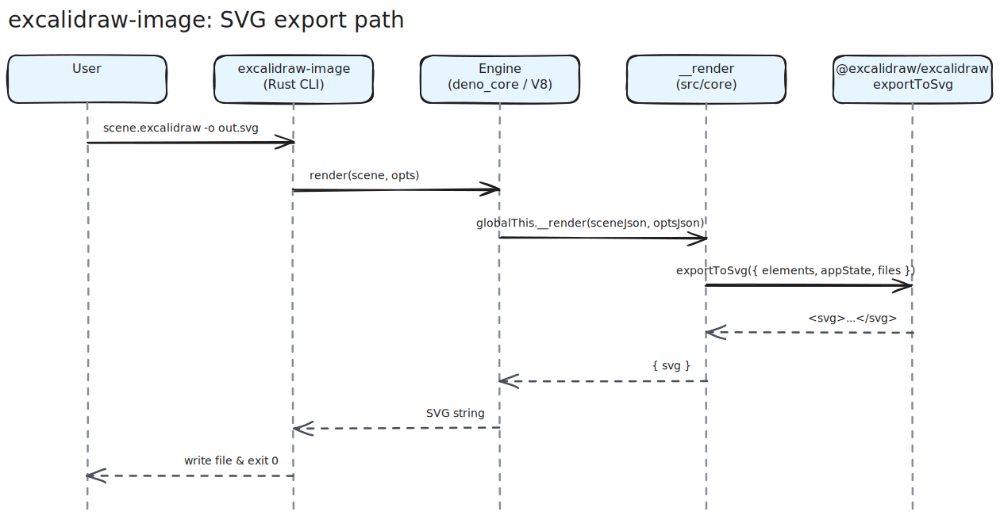

# excalidraw-image

Convert `.excalidraw` scenes to SVG and PNG. Self-contained native binary;
no Node/Bun/Deno runtime required.

## Status

The renderer, font subsystem, SVG parity gate, PNG path, and release
automation are implemented and tested. The current release workflow is
tag-driven: `cargo release ... --execute` bumps the version, pushes a `v*`
tag, publishes crates, builds release tarballs, updates the in-repo Homebrew
formula, and un-drafts the GitHub Release when all jobs succeed.

## Install

### Homebrew

The formula ships from this repo (no separate tap repo). One-time tap:

```
brew tap rickardp/excalidraw-image https://github.com/rickardp/excalidraw-image.git
brew install excalidraw-image
```

Tap + formula land on the first release. Until then, use direct downloads
from [GitHub Releases](https://github.com/rickardp/excalidraw-image/releases).

### Cargo

```
cargo install excalidraw-image                  # Latin-only (~48 MB binary)
cargo install excalidraw-image --features cjk       # + modern CJK (~78 MB)
cargo install excalidraw-image --features cjk-full  # + long-tail CJK (~83 MB)
```

The default build bundles only Latin-script fonts to keep the install fast
and the binary small. Pick a CJK tier based on what your scenes contain:

- **`cjk`** — modern Chinese, Japanese kanji, Korean Hangul Syllables,
  and common CJK punctuation. The right choice for almost everyone who
  renders CJK text day-to-day.
- **`cjk-full`** — implies `cjk`, plus CJK Extension A
  (classical/historical ideographs, scholarly texts, dialect-specific
  terms), CJK Compatibility Ideographs, CJK Radicals, and Hangul Jamo.
  Pick this if you render classical Chinese, philological texts, or
  obscure surnames.

The Homebrew formula and prebuilt binaries on GitHub Releases ship with
`cjk-full` enabled, so users on those channels never need to think about
the feature flags.

Crates.io is the supported source-install path after the first published
release. Before that, `cargo install --path crates/excalidraw-image` from a
clone works.

### Direct download

Per-platform tarballs land on
[GitHub Releases](https://github.com/rickardp/excalidraw-image/releases)
for each tagged release. The binary is one self-contained executable; no
runtime dependencies.

## Quickstart

```
excalidraw-image scene.excalidraw -o scene.svg
excalidraw-image scene.excalidraw -o scene.excalidraw.svg --embed-scene
excalidraw-image scene.excalidraw -o scene.png --scale 2
```

The first writes plain SVG. The second writes an editable
`.excalidraw.svg` that round-trips on excalidraw.com (open it in the web app
to keep editing). The third rasterizes to PNG at 2x.

Inputs and outputs both accept `-` for stdin/stdout. Format is inferred from
the output extension when not given explicitly.

## CLI reference

`excalidraw-image --help` is the source of truth. Major option groups:

- **Inputs** — positional path or `-` for stdin.
- **Outputs** — `-o/--output`, `--format`, `--embed-scene`.
- **Rendering** — `--no-background`, `--dark`, `--padding`, `--scale`,
  `--frame`, `--max`.
- **Fonts** — `--skip-font-inline`, `--strict-fonts`.

## Compatibility & fidelity

The SVG and PNG output is generated by the same export path that
excalidraw.com uses, embedded into a native shell. Element placement,
sizing, colors, and stroke styles match the web app. Text metrics are
within 0.0005 px of Chromium `canvas.measureText` for the eight bundled
font families, as locked by `tests/js/browser-fidelity.test.mjs`. Editable
`.excalidraw.svg` files round-trip: re-opening on excalidraw.com preserves
element IDs, files, and font-family metadata.

Documented divergences include emoji (Segoe UI Emoji is not bundled),
embeddables (iframes / YouTube / video are not rendered), and OS-local
fonts (only the bundled WOFF2s ship). The full list and rationale is in
[docs/fidelity.md](docs/fidelity.md).

## How it works

`excalidraw-image` embeds a `deno_core` JS engine that runs a bundled copy
of Excalidraw's export path. The JS produces the SVG; native `resvg`
rasterizes it to PNG when needed. SVG output is byte-identical to what
`exportToSvg` from `@excalidraw/excalidraw` produces in a browser. The
shipped binary is one statically-linked executable per platform, around 88
MB on macOS arm64 with the full CJK font set enabled — V8 plus bundled fonts
dominate.

Key implementation choices:

- The JS core consumes the published `@excalidraw/excalidraw` npm package
  instead of vendoring Excalidraw source.
- `src/core/**` stays host-neutral: it has DOM, canvas, `FontFace`, fetch,
  timer, URL, text-encoding, and worker shims, and exposes
  `globalThis.__render(scene, opts)`.
- Deno is the fast dev host; the shipped CLI embeds the same bundled JS in
  Rust through `deno_core`. The parity gate diffs both hosts byte-for-byte
  on every fixture.
- Native PNG output is produced by Rust `resvg` from the SVG that Excalidraw
  exported.
- Fonts are bundled as WOFF2-derived Rust font packs. Cargo users can pick
  Latin-only, `cjk`, or `cjk-full`; prebuilt binaries ship `cjk-full`.

Approximate binary makeup on macOS arm64:

| Component | Size driver |
|---|---|
| `deno_core` + `rusty_v8` | V8 runtime dominates the base binary. |
| JS bundle | Excalidraw export path, shims, font metadata. |
| Font packs | Latin + optional Xiaolai CJK shards. |
| PNG stack | `resvg`, `usvg`, `tiny-skia`, `fontdb`, WOFF2 decode support. |



The diagram above is dogfooding: it is an editable `.excalidraw.svg`
rendered through this tool with `--embed-scene`, so opening the SVG on
[excalidraw.com](https://excalidraw.com) lets you keep editing it.

## Build from source

```
git clone https://github.com/rickardp/excalidraw-image
cd excalidraw-image
make bootstrap   # npm + cargo + deno cache
make core        # build dist/core.mjs
cargo build --release -p excalidraw-image
```

The release binary lands at `target/release/excalidraw-image`. Cold start
is around 220 ms median on `tests/fixtures/basic-shapes.excalidraw`.

Requirements: Rust 1.75+, Node 20+, Deno (for the dev parity gate). PNG
support pulls in a C++ build-time dependency for WOFF2 decoding
(`woofwoof`) because the embedded PNG font database needs decoded TTF data.

## Testing

```
make test
```

Runs the JS unit suite (vitest), the Rust integration tests (`cargo test`),
and the parity gate that diffs Deno output against Rust output on every
fixture in `tests/fixtures/`. Both hosts must produce byte-identical SVG
or the build fails.

To regenerate the committed SVG goldens after an intentional rendering
change: `make goldens`.

## Releasing

Driven by [`cargo release`](https://github.com/crate-ci/cargo-release)
locally and `.github/workflows/release.yml` on push:

```
cargo release patch --execute    # 0.1.0 -> 0.1.1, commits, tags v0.1.1, pushes
```

The tag itself is the gate — pushing it triggers the release workflow,
which:

1. Verifies the tag matches `crates/excalidraw-image/Cargo.toml`.
2. Creates a draft GitHub Release.
3. `cargo publish` to crates.io (idempotent on rerun).
4. Builds CLI binaries for `x86_64-unknown-linux-gnu`,
   `aarch64-apple-darwin`, `x86_64-apple-darwin`,
   `x86_64-pc-windows-msvc`. Tarballs uploaded to the release.
5. Renders `Formula/excalidraw-image.rb` from the in-repo template and
   commits it back to `main` with `[skip ci]` so the next `brew tap`
   sees the bumped formula.
6. Un-drafts the release.

Required secret: `CARGO_REGISTRY_TOKEN`. Everything else uses the
built-in `GITHUB_TOKEN`. macOS notarization is **not** wired in v1 —
first-run users hit Gatekeeper; document
`xattr -d com.apple.quarantine target/release/excalidraw-image` if it
matters. Linux ARM64 is deferred (woofwoof C++ dep + cross-compile).

## License

MIT. See [LICENSE](LICENSE).

## Acknowledgements

Built around [`@excalidraw/excalidraw`](https://github.com/excalidraw/excalidraw)
upstream. The export path, font subsetter, and rough.js integration are
their work; this project bundles them into a host-neutral native CLI.
